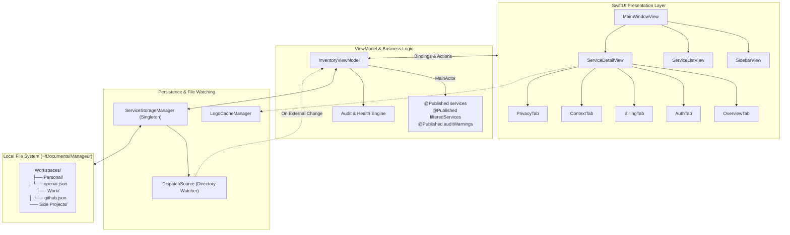

# Manageur 🛡️

<div align="center">

[](https://swift.org)
[](https://apple.com/macos)
[](https://developer.apple.com/documentation/swiftui)
[](https://www.json.org)
[](https://github.com/Rasalp1/Manageur)
[](LICENSE)

<br/>

**A native, keyboard-first macOS application for cataloging, auditing, and maintaining sovereignty over all your digital services, SaaS subscriptions, API connectors, authentication mechanisms, and data footprints.**

<br/>

```
🏷️ Tags: #macos #swiftui #swift #saas-management #inventory-tracker #security-audit #privacy #gdpr #subscription-tracker #offline-first #local-first #plain-json #developer-tools
```

</div>

---

## 📑 Table of Contents
1. [Overview](#-overview)
2. [Why Manageur?](#-why-manageur)
3. [Key Highlights & Capabilities](#-key-highlights--capabilities)
4. [Architecture & Workflow](#-architecture--workflow)
5. [The Audit & Health Engine](#-the-audit--health-engine)
6. [On-Disk Storage & Zero Vendor Lock-in](#-on-disk-storage--zero-vendor-lock-in)
7. [Service Data Model & JSON Schema](#-service-data-model--json-schema)
8. [User Interface & macOS Integration](#-user-interface--macos-integration)
9. [Project Directory Layout](#-project-directory-layout)
10. [Getting Started & Build Instructions](#-getting-started--build-instructions)
11. [Running Tests](#-running-tests)
12. [Roadmap](#-roadmap)
13. [License](#-license)

---

## 🌟 Overview

Modern developers, creators, and knowledge workers manage dozens (or hundreds) of digital services: hosting platforms, AI model APIs, cloud databases, analytics suites, design tools, and productivity subscriptions. Over time, this leads to **SaaS sprawl**, unmonitored recurring expenses, abandoned accounts containing sensitive personal data, and security vulnerabilities like missing two-factor authentication (2FA).

**Manageur** solves this by providing a unified, privacy-respecting, native macOS command center. Unlike SaaS inventory tools that demand read access to your email or bank credentials, Manageur is **100% offline-first and local-first**. Every record is stored directly on your disk as formatted `.json` files, organized cleanly by workspace, and watched in real time for external changes or Git syncs.

---

## ❓ Why Manageur?

| Challenge | Traditional SaaS Trackers | Manageur Solution |
| :--- | :--- | :--- |
| **Privacy & Sovereignty** | Require third-party cloud hosting, OAuth scraping of emails or bank accounts. | **100% Local-First**. Your data never leaves your Mac unless you choose to sync via your own private Git repository. |
| **Data Format** | Proprietary databases or vendor-locked binary formats. | **Human-Readable JSON**. Open in VS Code, Vim, or automate with `jq` and shell scripts. |
| **Security Auditing** | Superficial cost summaries without auth or privacy context. | **Proactive Security Audits**: detects missing 2FA, forgotten trials, and unrecorded GDPR/deletion links. |
| **macOS Native Feel** | Sluggish Electron or web wrappers with non-native UX. | **100% Swift & SwiftUI**. Native 3-column split view, unified toolbar, keyboard shortcuts, and silky smooth performance. |
| **Extensibility** | Closed APIs, paywalled export features. | **Git-Native**. Version control your `~/Documents/Manageur` folder directly. |

---

## 🚀 Key Highlights & Capabilities

### 1. 🗂️ Native Three-Column macOS Interface
- **Sidebar**:
  - Filter by workspaces: `Personal`, `Work`, `Side Projects`, or user-defined custom workspaces.
  - Category filtering across 12 standardized digital domains (AI & Models, Cloud & Infrastructure, Developer Tools, Finance & Payments, etc.).
  - Status filters: `Active`, `In Trial`, `Paused`, `Needs Cancellation`, and `Deprecated`.
  - Smart Audit filters: zero in immediately on security risks, expiring trials, or duplicate subscriptions.
- **Middle Service List**:
  - High-speed real-time search across service names, domains, tags, auth emails, and notes.
  - Flexible sorting: alphabetical (A-Z / Z-A), monthly/annual cost (High to Low), renewal proximity, and recency.
  - At-a-glance status pills, formatted pricing badges, and automated logo resolution.
- **Inspector & Detail Canvas**:
  - Tabbed organization for deep documentation:
    - **Overview**: Identity, domain, quick launch button, category, tags, and rich notes.
    - **Auth & Access**: Authentication provider (Google, GitHub, Apple ID, Email/Password, SSO/SAML, Passkey), login identifier, 2FA enforcement method (TOTP, Hardware Key / FIDO2, Passkey, SMS), and recovery email.
    - **Billing & Cost**: Pricing tier, recurring amount, currency, billing cadence (Monthly, Annual, Pay-As-You-Go, One-Time, Free), next renewal date countdown, and payment method identifier.
    - **Projects & Context**: Linked code repositories, environment variable dependencies (e.g. `OPENAI_API_KEY`), and designated service owners.
    - **Privacy & Audit**: Summary of stored user data, GDPR erasure request URL, account deletion endpoint, data export links, and privacy policies.

### 2. 🛡️ Live Reactive Audit & Health Engine
The built-in audit engine analyzes your inventory in real time and raises prioritized warnings:
- 🚨 **Critical**: Trials that expired or expire today without explicit user review.
- ⚠️ **Warning**: Trials ending within the next 7 days, giving you ample time to cancel before being billed.
- ⚠️ **Security Warning**: Active paid or critical infrastructure services (Cloud, Dev Tools, Finance, Identity) operating without Two-Factor Authentication.
- ℹ️ **Privacy Notice**: Deprecated or cancellation-pending services that lack an account deletion or GDPR erasure URL.
- ℹ️ **Redundancy Notice**: Identifies potential category overlaps (e.g., having 3 active cloud providers or multiple project management tools in the same workspace).

### 3. 💾 Zero Vendor Lock-in & Git-Friendly JSON Storage
- Every service is stored as an individual JSON document under `~/Documents/Manageur/<Workspace>/<slug>.json`.
- Customizable storage root path via the in-app Settings dialog (`Cmd+,`).
- Built-in `DispatchSourceFileSystemObject` file watcher automatically reloads the UI when JSON files are modified externally (e.g. via Git pull, shell scripts, or editor edits).

### 4. 🎨 Smart Favicon & Domain Logo Cacher
- Automatically derives and normalizes domains from service websites (e.g. `https://console.aws.amazon.com` → `aws.amazon.com`).
- Resolves high-resolution favicons asynchronously and caches them locally on disk.
- Graceful fallbacks to category-specific SF Symbols when offline or when no remote icon is available.

---

## 🏗️ Architecture & Workflow

Manageur follows clean **MVVM (Model-View-ViewModel)** architectural patterns with modern Swift concurrency and Combine integration:



---

## 🔍 The Audit & Health Engine

Manageur's diagnostic engine continuously scans services against hygiene and security baselines:

| Audit Type | Condition | Severity | Action Suggested |
| :--- | :--- | :--- | :--- |
| **Expired Trial** | `status == .trial` AND `renewalDate <= today` | 🔴 **Critical** | Cancel immediately to avoid unexpected credit card charge, or convert to Active. |
| **Expiring Trial** | `status == .trial` AND `renewalDate <= 7 days` | 🟠 **Warning** | Evaluate tool adoption before automatic renewal kicks in. |
| **Unprotected Account** | `status == .active` AND `isPaid == true` AND `2FA == .none` | 🟠 **Warning** | Enable TOTP authenticator app or hardware security key (FIDO2 / YubiKey). |
| **Missing 2FA (Infra)** | Critical category (Cloud, DevTools, Finance, Identity) with `2FA == .none` | 🔵 **Info** | Secure critical access point even if on a free tier. |
| **Unresolved Privacy** | `status == .deprecated` without `gdprDeletionUrl` | 🔵 **Info** | Locate service deletion URL to exercise right to erasure and purge stored data. |
| **Duplicate / Overlap** | $\ge 2$ active tools in the same workspace & category | 🔵 **Info** | Consolidate subscriptions to save cost and reduce administrative overhead. |

---

## 📁 On-Disk Storage & Zero Vendor Lock-in

Your services are organized in an intuitive file system hierarchy:

```
~/Documents/Manageur/
├── Personal/
│   ├── example-email.json
│   ├── example-streaming.json
│   └── example-mail-provider.json
├── Work/
│   ├── example-cloud.json
│   ├── example-vcs.json
│   ├── example-monitoring.json
│   └── example-design-tool.json
└── Side Projects/
    ├── example-database.json
    ├── example-payments.json
    └── example-hosting.json
```

### Version Controlling Your Inventory with Git
Because all data is plain JSON, you can initialize a Git repository directly in your storage folder:

```bash
cd ~/Documents/Manageur
git init
git add .
git commit -m "Initialize SaaS inventory"
# Optional: push to your private Git remote
git remote add origin git@github.com:youruser/my-private-inventory.git
git push -u origin main
```

---

## 🧩 Service Data Model & JSON Schema

Each service file contains complete configuration and context. Here is an annotated example of `github.json`:

```json
{
  "id": "A1B2C3D4-E5F6-7890-ABCD-EF1234567890",
  "name": "GitHub",
  "slug": "github",
  "domain": "github.com",
  "websiteURL": "https://github.com",
  "category": "Developer Tools",
  "workspace": "Work",
  "status": "Active",
  "tags": [
    "code",
    "git",
    "ci-cd",
    "infrastructure"
  ],
  "notes": "Primary version control, code review, and automated CI/CD workflows.",
  "dateCreated": "2026-09-06T16:00:00Z",
  "lastAudited": "2026-09-06T18:00:00Z",
  "authInfo": {
    "provider": "GitHub",
    "loginEmailOrUsername": "octocat@company.internal",
    "twoFactorMethod": "Hardware Key (YubiKey / FIDO2)",
    "recoveryEmail": "security-ops@company.internal",
    "ssoDomain": "company.okta.com"
  },
  "billingInfo": {
    "isPaid": true,
    "tierName": "GitHub Enterprise Cloud",
    "amount": 21.00,
    "currency": "USD",
    "billingCycle": "Monthly",
    "nextRenewalDate": "2026-10-01T00:00:00Z",
    "paymentMethodDescription": "Corporate Amex ending in 4019",
    "cancellationUrl": "https://github.com/organizations/company/settings/billing"
  },
  "contextInfo": {
    "linkedProjects": [
      "Manageur",
      "API-Gateway",
      "Core-Infrastructure"
    ],
    "dependencies": [
      "GitHub Actions Runners",
      "OAuth Application Connectors"
    ],
    "primaryOwner": "DevOps Lead"
  },
  "privacyInfo": {
    "dataStoredSummary": "Private source code repositories, commits, pull request discussions, secrets, deploy keys.",
    "gdprDeletionUrl": "https://github.com/settings/admin",
    "dataExportUrl": "https://github.com/settings/security",
    "privacyPolicyUrl": "https://docs.github.com/en/site-policy/privacy-policies/github-general-privacy-statement"
  }
}
```

---

## 🖥️ User Interface & macOS Integration

- **Toolbar Shortcuts**:
  - `Cmd + N`: Launch the **Add New Service** modal.
  - `Cmd + ,`: Open the **Settings & Storage** preferences sheet.
  - `Cmd + S` / Auto-Save: Instant debounce saving when editing attributes in the Inspector.
- **Unified Title Bar & Split Navigation**: Smooth column resizing with minimal frame bounds (850×520 pt minimum window dimension).
- **Dark Mode & Dynamic Appearance**: Respects macOS system appearance with high-contrast text and vibrant accent colors.
- **One-Click Actions**:
  - Direct web links to the service dashboard, privacy portal, and account cancellation flow.
  - Workspace selector with instantaneous live-filtered counts.

---

## 📂 Project Directory Layout

```
Manageur/
├── Package.swift                  # Swift Package Manager manifest (Swift 5.9+, macOS 14.0+)
├── README.md                      # Comprehensive project documentation
├── .gitignore                     # Git ignore rules for Swift, SPM, and macOS
├── Sources/
│   └── Manageur/
│       ├── ManageurApp.swift      # Main Application entry point & initial sample seeder
│       ├── Models/
│       │   ├── ServiceItem.swift      # Core service model, Auth, Billing, Context & Privacy structures
│       │   ├── ServiceCategory.swift  # 12 standardized category enums with SF Symbol mappings
│       │   ├── ServiceStatus.swift    # Status enum (Active, Trial, Paused, Needs Cancellation, Deprecated)
│       │   └── AuditWarning.swift     # Diagnostic warnings model and severity definitions
│       ├── Storage/
│       │   ├── ServiceStorageManager.swift # Disk I/O, atomic JSON serializer, and DispatchSource file watcher
│       │   └── LogoCacheManager.swift      # Remote favicon fetcher, memory & disk caching pipeline
│       ├── ViewModels/
│       │   └── InventoryViewModel.swift    # Reactive state manager, filtering, sorting & audit rules engine
│       └── Views/
│           ├── MainWindowView.swift        # Primary 3-column NavigationSplitView container
│           ├── ServiceLogoView.swift       # Async domain icon with SF Symbol fallback rendering
│           ├── Sidebar/
│           │   └── SidebarView.swift       # Workspace, Category, Status & Audit diagnostic selectors
│           ├── MiddleList/
│           │   ├── ServiceListView.swift   # Searchable inventory list with sorting controls
│           │   └── ServiceRowView.swift    # Service item row cell with badges & cost display
│           ├── Modals/
│           │   ├── NewServiceSheet.swift   # Multi-tab creation sheet for new services
│           │   └── SettingsView.swift      # Custom storage directory selector & diagnostics
│           └── Detail/
│               ├── ServiceDetailView.swift # Inspector detail container with tab navigation
│               ├── OverviewTab.swift       # Identity, category, URL & Markdown notes
│               ├── AuthTab.swift           # Auth methods, 2FA configuration & identity metadata
│               ├── BillingTab.swift        # Pricing tiers, currencies, renewals & cancellation links
│               ├── ContextTab.swift        # Linked projects, system dependencies & service owners
│               └── PrivacyTab.swift        # GDPR links, data export endpoints & data summaries
└── Tests/
    └── ManageurTests/
        └── ManageurTests.swift     # Automated test suite (JSON serialization, slugs, audit engine)
```

---

## 🛠️ Getting Started & Build Instructions

### Prerequisites
- **macOS Sonoma (14.0)** or **macOS Sequoia (15.0+)**
- **Xcode 15+** or the standalone **Swift 5.9+ Command Line Tools**
- Git

### Quick Run via Terminal
You can clone and run the app directly using the Swift Package Manager CLI:

```bash
# Clone the repository
git clone https://github.com/Rasalp1/Manageur.git
cd Manageur

# Build and run the app
swift run Manageur
```

### Developing in Xcode
To open and edit using Xcode:

```bash
open Package.swift
```
Select the `Manageur` executable scheme and press `Cmd + R` to build and run.

---

## 🧪 Running Tests

Manageur includes an automated test suite verifying serialization correctness, slug generation, and audit engine diagnostic accuracy:

```bash
swift test
```

### Test Coverage Highlights
- ✅ `testServiceItemJSONSerialization`: Verifies lossless round-trip encoding and decoding of complex `ServiceItem` instances including dates, nested structs, and optional values.
- ✅ `testSlugGeneration`: Confirms filename sanitization from diverse input formats (e.g. `Google Cloud Platform` → `google-cloud-platform`).
- ✅ `testAuditWarningsEngine`: Tests four distinct audit scenarios:
  1. Missing 2FA on paid / critical infrastructure accounts.
  2. Expiring trials within threshold windows.
  3. Deprecated services lacking account deletion links.
  4. Redundant services sharing identical categories in the same workspace.

---

## 🗺️ Roadmap

- [ ] **Menu Bar Status Companion**: Lightweight menu bar helper displaying impending trial renewals and security notices.
- [ ] **CSV / 1Password / Bitwarden Import**: Ingest existing credentials and subscriptions directly into Manageur.
- [ ] **Automated Deletion Assistant**: Guided checklist and template emails for GDPR Article 17 "Right to Erasure" requests.
- [ ] **Cost Analytics & Currency Conversion**: Total monthly/annual expenditure charts with automatic foreign exchange rate normalization.
- [ ] **Encrypted Vault Option**: Optional local encryption layer using Apple Keychain and CryptoKit for sensitive metadata.

---

## 📄 License

Manageur is open-source software released under the [MIT License](LICENSE).
